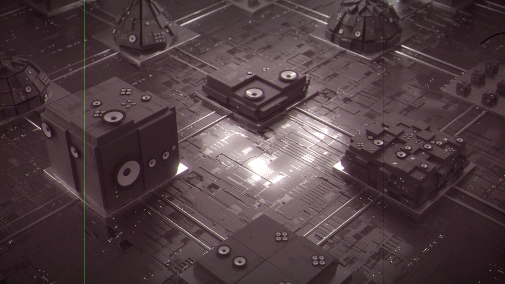
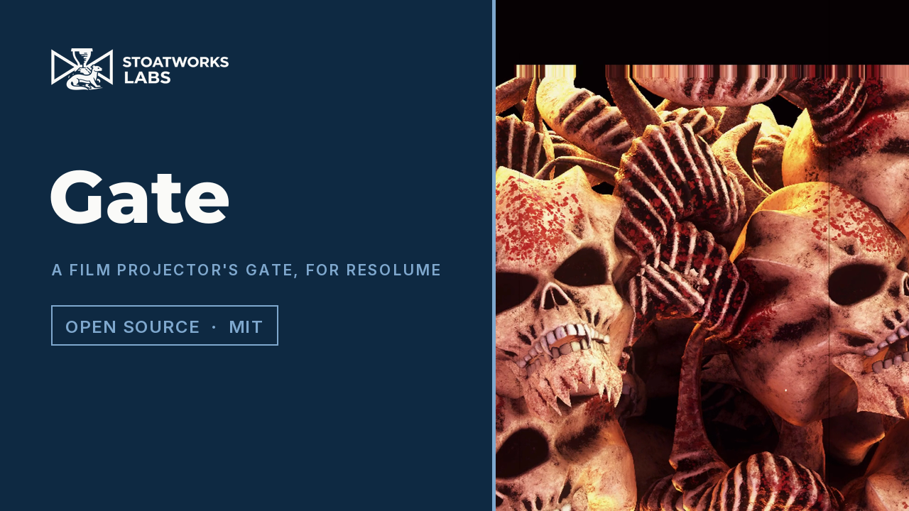

# gate

> **AI-assisted project.** This codebase was created with [Claude](https://claude.com/claude-code)
> (Anthropic), directed and reviewed by a human author. The projector is not asserted
> but measured: an offline harness drives the real plugin class in a headless GL context
> on a synthetic clock and reads every property back out of the picture it renders — a
> flat grey's brightness at 60 Hz has, bin for bin to 2e-8, the spectrum the shutter's
> own Fourier series predicts, its strongest line at the 12 Hz beat of 48 Hz against 60;
> the picture changes only at pull-downs, 24 times a second at 24 fps, and every
> pull-down happens in exactly the dark; a scratch holds its x to 2e-5 px while the
> picture weaves and slides under it, dark on the base side and light on the emulsion;
> a thousand frames' weave has the stated deviation and lag-1 correlation, more and less
> of each on a shrunk print; a grey through Age keeps each dye's stated density to 1e-7
> and goes magenta; and a resize leaves the print and the previous frame untouched —
> with eight negative controls that prove each check can fail. It has **never been
> loaded into Resolume on macOS**; there it is loaded by [oxbow](https://github.com/stoatworks-labs/oxbow),
> which is a real FFGL host and is not Resolume. On Windows it passes the fleet's Arena gate
> in Resolume Arena 7.27.1 on software rendering. See [Status](#status).

A film projector's gate, shutter and print, as an FFGL effect for
[Resolume](https://resolume.com) Arena and Avenue.



<sub>One frame, rendered by `gatest --pipe`, the offline harness — not captured from
Resolume. Resolume's bundled demo clip Beat 001 at the defaults, with Hair up.</sub>

<!-- downloads:start -->

## Download

**[v0.1.0](https://github.com/stoatworks-labs/gate/releases/tag/v0.1.0)** — prebuilt for macOS and Windows. Pick your platform:

<details>
<summary><b>macOS</b> — Universal (Apple Silicon + Intel)</summary>

| Build | Download | Size |
| --- | --- | --- |
| Universal (Apple Silicon + Intel) · .dmg disk image | [`gate-0.1.0-macos-universal.dmg`](https://github.com/stoatworks-labs/gate/releases/download/v0.1.0/gate-0.1.0-macos-universal.dmg) | 225 KB |
| Universal (Apple Silicon + Intel) · .zip archive | [`gate-macos-universal.zip`](https://github.com/stoatworks-labs/gate/releases/latest/download/gate-macos-universal.zip) | 189 KB |

</details>

<details>
<summary><b>Windows</b> — x64</summary>

| Build | Download | Size |
| --- | --- | --- |
| x64 · .exe installer | [`gate-0.1.0-windows-x86_64-setup.exe`](https://github.com/stoatworks-labs/gate/releases/download/v0.1.0/gate-0.1.0-windows-x86_64-setup.exe) | 224 KB |
| x64 · .zip archive | [`gate-windows-x86_64.zip`](https://github.com/stoatworks-labs/gate/releases/latest/download/gate-windows-x86_64.zip) | 118 KB |

</details>

All builds, checksums and release notes: [github.com/stoatworks-labs/gate/releases](https://github.com/stoatworks-labs/gate/releases).

macOS builds are signed and notarised and open normally. The Windows builds are unsigned, so SmartScreen warns once.

<!-- downloads:end -->

## Video

[](https://www.youtube.com/watch?v=y9B5l5ynnUY)

60 fps, because the hold and the flicker are beats against the display rate. It never shows the classic 2-blade, 180° shutter (see the photosensitivity note below).

## The one idea

Model the machine, not the look. A projector pulls the film down a frame at a time with a
claw, holds it in the gate against the claw's clearance, and lets the lamp through only
while a shutter blade is out of the way — two or three times a frame, so the flicker is
above what the eye can see. The print going through it is a physical strip with grit,
dust and splices on it, and dyes that fade.

So the clip is held at the projector's rate, the light the blades pass is integrated over
each frame your display shows, each frame lands in the gate with its own offset, and every
mark on the picture belongs to the print or the gate.

## What falls out

None of these is drawn as an effect. Each is the machine doing what it does:

- **Flicker at the beat.** A two-blade shutter at 24 fps interrupts the light 48 times a
  second. A 60 Hz display integrating that sees it beat at 12 Hz; three blades (72 Hz) beat
  at 12 Hz too, but softer; 25 fps with two blades at 10 Hz. How deep is set by the
  shutter's opening, and nothing else.
- **The hold.** The picture changes only when the claw pulls down, which it does in the
  dark. A 30 fps clip at 24 fps judders the way film on television does, and a display
  frame that spans a pull-down shows both frames, in proportion to the light each got.
- **Weave.** Each frame lands a little off, and a frame is like the last one because the
  same perforator punched them. A shrunk print, whose perforations no longer sit on the
  teeth, weaves more and less smoothly.
- **Scratches stay put.** Grit in the gate cuts the strip as it runs, so a scratch is a
  straight line at a fixed place on screen while the picture weaves and moves under it.
  On the base side it scatters light away and prints dark; on the emulsion side it takes
  dye off, the magenta layer first, so it prints green, then yellow, then clear.
- **Dust, a hair, a splice, the cue dots.** Specks ride the print for a frame or a few; a
  hair caught at the aperture's edge trembles at every pull-down until it shakes loose; a
  splice jumps and flashes; the reel-change marks appear top right when you fire them.
- **The frame line.** Mis-frame by more than the aperture's margin and the black line
  between frames comes into view, with the next picture beyond it.
- **An old print goes magenta.** The cyan dye fades first and the magenta last, so a grey
  goes pink and the blacks and the frame line go red.

### The honest limit

The machine's geometry is published (the 35 mm frame pitch, the apertures, the cue
timing), but its behaviour is chosen: the weave's size and correlation and how shrinkage
changes them, the scratch and dust rates, the hair, and the three dyes' fading rates are
numbers picked to show the right thing, not measured from a projector or a print. The
lamps are black bodies, which a carbon arc and a xenon lamp are not. A display frame that
spans a pull-down really does show two frames, and on fast motion that reads as a double
image every few frames. And a transparent clip prints as black film.

## Controls

| Group | |
| --- | --- |
| **Projector** | FPS (16, 18, 24, 25), Blades (1, 2, 3), Shutter Angle (each blade's opening, 45–315°), Lamp (Carbon Arc, Xenon, Tungsten), Framing (±half a frame). |
| **Gate** | Weave, Shrinkage (0–2%), Hair. |
| **Print** | Scratches, Dust, Splices (0–60 a minute), Cue Dots (press to mark the reel), Age. |
| **Output** | Vignette (the lens's cos⁴ falloff to the corners), Mix. |

The defaults are a three-blade projector at 24 fps with a 270° opening and a xenon lamp,
running a lightly worn print: some weave, a few scratches and specks, a hair now and then,
three splices a minute, and dyes just starting to go. Chosen on Resolume's demo clips.

> **Photosensitivity.** The flicker is a whole-frame pulse at the beat of the projector
> against your output: 12 Hz at 60 Hz, inside the 3–30 Hz band broadcast flash guidelines
> restrict. The default shutter keeps it to about ±7–9% of the light; the classic 35 mm
> shutter, 2 blades at 180°, beats by about ±25–29%, which is why it is not the default. The
> [user guide](https://stoatworks-labs.com/software/gate/guide/) has the table.

The output is opaque at Mix 1: the projection paints the whole frame, whatever the clip's
alpha.

## Status

**v0.1.0, released 25 September 2026, and honestly early.** There is a
[user guide](https://stoatworks-labs.com/software/gate/guide/)
([PDF](docs/USER-GUIDE.pdf)) and a [project page](https://stoatworks-labs.com/software/gate/).

### Measured offline, on macOS

`tools/verify.sh` passes on this machine (M4 Max, macOS 26.4) against a fresh universal
Release build, running every check at 320×180 and 1280×720 and again on Apple's software
renderer, which is what a GPU-less CI runner has. What it establishes:

- **Flicker.** Two blades at 24 fps: the strongest line at 12.00 Hz, amplitude 0.29271,
  against 0.29271 from the Fourier series; three blades 0.19514 at 12 Hz; 25 fps 0.23094
  at 10 Hz; 18 fps × 3 blades at 240° 0.08953 at 6 Hz. Every DFT bin within 2.3e-8.
- **Hold.** Every display frame inside one projector frame shows the input captured at
  its pull-down; every one spanning a pull-down blends the two frames in the shutter's
  proportions; 24 (and 25) pictures captured each second. At 2400 Hz every exposure that
  contains a pull-down is exactly black.
- **Scratch.** A scratch on whole pixels takes exactly its columns, on every frame of a
  moving, weaving picture; one at a fractional x reads back to 1.8e-5 px and does not
  move; the print's own keep their profiles; base dark, emulsion light, every time.
- **Weave.** A thousand frames: standard deviation 1.906 px against 1.884 stated, lag-1
  correlation 0.742 against 0.750; at 2% shrinkage 5.779 against 5.651 and 0.372 against
  0.375 (at 1280×720).
- **Fade.** Each dye keeps the density its law says to 1e-7 at three ages; red and blue
  rise past green.
- **Resize.** A resize to 1.5× and back leaves the print exactly as it would have been, and
  the frame held before it still lit.
- **Negative controls.** A shutter sampled at one instant fails the flicker; no hold fails
  the hold; scratches riding the picture fail the scratch; uncorrelated weave and weave
  that ignores shrinkage fail the weave; dyes fading alike fail the fade; a resize that
  makes a new print, or clears the held pictures, fails the resize.
- **No dead controls**: all 15 change the picture.
- **The bundle** is universal, and oxbow sees `SW Gate`, `GA01`, an effect, and renders 120
  frames through it.

Render cost, `gatest --bench` (the defaults, best of three, `glFinish` both sides, a
shared GPU):

| | ms/frame | % of a 60 fps frame | state held |
| --- | --- | --- | --- |
| 1280×720 | 0.085 | 0.5% | 14 MB |
| 1920×1080 | 0.094 | 0.6% | 32 MB |
| 3840×2160 | 0.265 | 1.6% | 127 MB |

The state is the two held pictures, RGBA16F at the input's raster (plus a third for the
one frame of a resize); the print is on the CPU and costs a 4 KB texture row.

### In Resolume Arena, on Windows

On Windows it has: a build of this source loads, registers and renders in Resolume Arena 7.27.1 on software rendering (win-lab, Mesa llvmpipe, no GPU), with all 21 host controls matching what the plugin declares, in the fleet's Arena gate (9 of 9 checks). The gate's picture is a still, but the projection never stands still (the weave, the dust and the flicker change every frame, a noise floor of 7.3 levels), so 9 of the 15 valued controls read as moving the picture and six read inconclusive (FPS, Shutter Angle, Scratches, Dust, Hair, Splices); none read dead. Software rendering says nothing about a GPU or about speed.

### What filming the release video found

The video is rendered through `gatest --pipe` at 60 Hz over Resolume's demo clips and a
panorama panned at exactly 8 px a display frame, and cut at 60 fps (the hold and the flicker
are beats against the display rate). It confirmed the hold on screen (at 24 fps a picture is
held for two or three display frames, and the frame spanning a pull-down shows both pictures;
at 16 fps the steps are larger) and found no defect. It never shows the classic shutter (see
the default below); the deepest flicker filmed is 2 blades at 270°, for three seconds. The
print's marks read only on bright clips: on the thin-lines-on-black loops there is little
light for a scratch or a speck to take away.

### Not done

- **Never loaded into Resolume on macOS.**
- Seen only on Resolume's bundled demo clips, never on camera footage or film scans.
- **No Stock control** (the spec imagined one; this release has Age only), no seed, no
  display-shutter control for the double images, no OpenFX port, no factory presets.

## Browser demo

[gate-demo.stoatworks-labs.com](https://gate-demo.stoatworks-labs.com/) runs the
plugin's own capture, resample and output shaders in WebGL2, spliced in from
`source/Shaders.cpp` by `demo/tools/sync_shaders.py` and checked character for
character, with Model.h's constants, by `demo/tools/check_shaders.py` from
`tools/verify.sh`. So the hold, the gate, the print and the shutter's sum run on the GPU
over the same two RGBA16F held pictures. Its CPU half — the shutter's light per
projector frame, the weave, every scratch, speck, hair, splice and cue dot, the dyes and
the lamps, and every control's law — is a hand port to JavaScript that only a reader
checks, and the page says so. Driven frame by frame against `gatest --pipe --fps 60` on
the same input it agrees to 1/255 on every pixel. The flicker beats against the
browser's own frame rate, so what it shows depends on your display; the page carries a
photosensitivity note. Generated clips only, or your own image or video, which never
leaves the page.

## Build

Needs CMake 3.15+, a C++17 compiler and the FFGL SDK submodule.

```sh
git clone --recurse-submodules https://github.com/stoatworks-labs/gate
cd gate
cmake -B build -DCMAKE_BUILD_TYPE=Release
cmake --build build --parallel
```

The macOS bundle is universal (Apple Silicon and Intel). `cmake --install build` copies
it into `~/Documents/Resolume Arena/Extra Effects`; for Avenue, pass
`--prefix "$HOME/Documents/Resolume Avenue/Extra Effects"`.

## Building and testing

```sh
tools/verify.sh                                   # everything, ~6 minutes
./build/gatest --list                             # the parameters
./build/gatest --flicker --size 320x180           # one check
./build/gatest --negative                         # every check can fail
python3 tools/sweep.py                            # no dead controls
ffmpeg -i clip.mov -vf fps=60 -f rawvideo -pix_fmt rgba - | ./build/gatest --pipe --size 1280x720 | ffplay -f rawvideo -pixel_format rgba -video_size 1280x720 -framerate 60 -
```

`CLAUDE.md` is the command reference and `AGENTS.md` the reasoning: the machine, the
traps, and where every tolerance comes from.

## License

MIT — see [LICENSE](LICENSE). What it builds on is in [ATTRIBUTIONS.md](ATTRIBUTIONS.md).

<!-- attributions:start -->
This project is built on other people's work — see [ATTRIBUTIONS.md](ATTRIBUTIONS.md).
<!-- attributions:end -->
